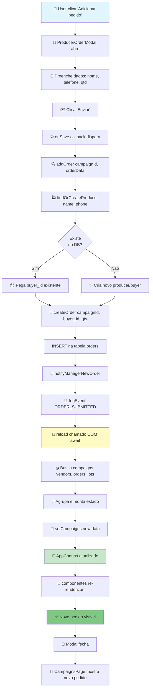

# 📊 Análise Completa: Fluxo de Pedidos na AgroColetivo

> Documento técnico detalhando como pedidos são criados, sincronizados e atualizados em tempo real

---

## 1. ARQUITETURA GERAL

```
┌─────────────────────────────────────────────────────────────┐
│                      APP.JSX (Raiz)                          │
│  └─ <AppProvider />                                          │
│     └─ Provê contexto centralizado para toda aplicação       │
└─────────────────────────────────────────────────────────────┘
                          │
                          ▼
┌─────────────────────────────────────────────────────────────┐
│                      AppContext                              │
│  • campaigns[], vendors[], ownVendor  (Estado)              │
│  • addOrder(), updateOrder(), deleteOrder()                 │
│  • reload(), reloadCampaign() (Síncrono)                    │
│  • Demais funções de campanhas                              │
└─────────────────────────────────────────────────────────────┘
                          │
         ┌────────────────┼────────────────┐
         ▼                ▼                ▼
    CampaignsPage    DashboardPage    VendorDashboardPage
    (Gestor)         (Admin/Gestor)    (Fornecedor)
```

---

## 2. ESTRUTURA DO CONTEXTO (AppProvider)

### **O que AppProvider fornece:**

```javascript
// AppProvider.jsx - linhas 30-70

const contextValue = {
  // AUTENTICAÇÃO
  user,                    // { id, name, email, role, phone, vendorId }
  isAuthenticated,
  profile,
  login(), register(), logout(),

  // CAMPANHAS (Estado + Funções)
  campaigns: [],           // Estado principal de campanhas
  vendors: [],             // Fornecedores cadastrados
  ownVendor: {},           // Vendor próprio (se user é VENDOR)
  campaignsLoading,        // Booleano
  campaignsError,          // String com erro

  // FUNÇÕES DE CAMPANHAS
  addCampaign(),
  updateCampaign(),
  deleteCampaign(),
  publishToVendors(),
  publishToBuyers(),
  closeToBuyers(),

  // ✅ FUNÇÕES DE PEDIDOS (POR ISSO CHAMAMOS addOrder)
  addOrder(campaignId, orderData),      // ← CRIA NOVO PEDIDO
  updateOrder(),
  deleteOrder(),
  addPendingOrder(),
  approvePending(campaignId, orderId),
  rejectPending(campaignId, orderId),

  // ✅ RELOAD - SINCRONIZAÇÃO
  reload(),                // ← Recarrega TUDO (campaigns, vendors)
  reloadCampaign(id),      // ← Recarrega UMA campanha

  // NOTIFICAÇÕES
  notifications: [],
  addNotification()
};
```

**Obs:** `addOrder` NÃO está em `updateOrder` — ele é uma função separada que:

1. Cria um novo pedido no Supabase
2. Envia notificação por email
3. **NÃO chama `reloadCampaign()` automaticamente** (deixa para a página chamar)

---

## 3. FLUXO DE CRIAÇÃO DE PEDIDOS

### **3.1 Estrutura de um Pedido (Order)**

```javascript
// Tabela 'orders' no Supabase
{
  id: UUID,
  campaign_id: UUID,       // ← Une a campanha
  buyer_id: UUID,          // ← Comprador (criado/encontrado em producers)
  qty: number,             // Quantidade pedida
  status: 'approved'|'pending'|'rejected',
  submitted_at: timestamp,
  reviewed_at: timestamp,
  lot_id: UUID|null        // ← Qual lote atende este pedido
}
```

### **3.2 Fluxo: Criar Pedido em CampaignsPage**

```
1️⃣ TRIGGER: Usuário clica botão "Adicionar pedido"
   └─ Modal ProducerOrderModal é exibido

2️⃣ USUÁRIO PREENCHE DADOS:
   ├─ producerName: "João da Silva"
   ├─ phone: "(11) 99999-9999"
   └─ qty: 500

3️⃣ USUÁRIO CLICA "ENVIAR PEDIDO"
   └─ CampaignsPage.jsx linha 2634 dispara:

      await addOrder(active.id, orderData);
      console.log("✅ Pedido criado, chamando reload()");
      await reload(); // ✅ AWAIT para garantir conclusão
      console.log("✅ reload() completo!");

4️⃣ addOrder() EXECUTA (no hook useCampaigns)
   ├─ Busca/cria Produtor: findOrCreateProducer(name, phone)
   │  └─ Consulta 'producers' ou 'buyers' no Supabase
   │     └─ Se não existir, cria novo
   │
   ├─ Cria Pedido: await createOrder(campaignId, buyer.id, qty, "approved")
   │  └─ INSERT na tabela 'orders'
   │
   ├─ Log de evento: logEvent(campaignId, EVENT.ORDER_SUBMITTED, ...)
   │
   └─ Envia email: notifyManagerNewOrder(...)
      └─ {producerName, phone, qty, product}

5️⃣ reload() EXECUTA (mandatoriamente chamado por CampaignsPage)
   └─ Veja seção 5 (Como reload funciona)

6️⃣ TELA RE-RENDERIZA
   ├─ campaign.orders[] agora inclui novo pedido
   ├─ Campaign.pendingOrders[] ou Campaign.orders[]
   └─ Componentes componentes NotificationBell mostra notificação
```

### **3.3 Onde addOrder é Chamado**

| Página                       | Função              | Função de Criação       | Resultado                    |
| ---------------------------- | ------------------- | ----------------------- | ---------------------------- |
| **CampaignsPage.jsx**        | Linha 2634          | `addOrder()`            | Pedido com status `approved` |
| **ProducerPortalPage.jsx**   | Manual (formulário) | `POST /api/...`         | Pedido específico da página  |
| **BuyerOrderStatusPage.jsx** | Lookup por telefone | Sem criar, apenas busca | Consulta pedidos existentes  |

---

## 4. FLUXO DE ATUALIZAÇÃO DE DADOS

### **4.1 Como os dados são carregados inicialmente**

```javascript
// useCampaigns.js - função loadAll() (linhas 100-200)

const loadAll = useCallback(async () => {
  // ✅ Chamado:
  //    1. Na montagem do hook (useEffect)
  //    2. Quando user muda
  //    3. Manualmente quando reload() é chamado

  if (!user) {
    setCampaigns([]);
    setLoading(false);
    return;
  }

  setLoading(true);

  // ──────────────────────────────────────────────────────────
  // PASSO 1: RESOLVER vendorId (se necessário)
  // ──────────────────────────────────────────────────────────
  if (user.role === ROLES.VENDOR && !user.vendorId) {
    const { data: vRow } = await supabase
      .from("vendors")
      .select("id")
      .eq("user_id", user.id)
      .maybeSingle();

    if (vRow) {
      userWithVendorId = { ...user, vendorId: vRow.id };
    }
  }

  // ──────────────────────────────────────────────────────────
  // PASSO 2: BUSCAR CAMPANHAS E VENDORS EM PARALELO
  // ──────────────────────────────────────────────────────────
  const [rawCampaigns, rawVendors] = await Promise.all([
    fetchCampaigns(userWithVendorId), // Filtra por role do usuário
    fetchVendors(user.id, user.role),
  ]);

  // Resultado:
  // - rawCampaigns: Array de campanhas visíveis para este usuário
  // - rawVendors: Fornecedores cadastrados

  // ──────────────────────────────────────────────────────────
  // PASSO 3: BUSCAR PEDIDOS E LOTES DE TODAS AS CAMPANHAS (OTIMIZADO)
  // ──────────────────────────────────────────────────────────
  // ✨ ANTES: 1 query/campanha × N campanhas = N+1 queries
  // ✨ AGORA: 2 queries totais (fetchAllOrdersForCampaigns + fetchAllLotsForCampaigns)

  const campaignIds = rawCampaigns.map((c) => c.id);

  const [allOrders, allLots] = await Promise.all([
    isVendor ? Promise.resolve([]) : fetchAllOrdersForCampaigns(campaignIds),
    fetchAllLotsForCampaigns(campaignIds),
  ]);

  // allOrders = Array com TODOS os pedidos
  // allLots = Array com TODOS os lotes

  // ──────────────────────────────────────────────────────────
  // PASSO 4: AGRUPAR EM MEMÓRIA
  // ──────────────────────────────────────────────────────────
  const ordersByCampaign = groupBy(allOrders, "campaign_id");
  const lotsByCampaign = groupBy(allLots, "campaign_id");

  // ordersByCampaign = {
  //   "camp-123": [order1, order2, ...],
  //   "camp-456": [order3, order4, ...]
  // }

  // ──────────────────────────────────────────────────────────
  // PASSO 5: MONTAR CAMPANHAS COM PEDIDOS E LOTES
  // ──────────────────────────────────────────────────────────
  const withOrders = rawCampaigns.map((c) => {
    const orders = ordersByCampaign[c.id] ?? [];
    const lots = (lotsByCampaign[c.id] ?? []).map(normalizeLotRaw);

    // Filtrar pedidos por status
    const approved = orders
      .filter((o) => o.status === "approved")
      .map(normalizeOrder);
    const pending = orders
      .filter((o) => o.status === "pending")
      .map(normalizeOrder);

    // Para VENDORS, ocultar pedidos
    const visibleOrders = isVendor ? [] : approved;

    return {
      ...c,
      orders: visibleOrders,
      pendingOrders: isVendor ? [] : pending,
      lots: visibleLots,
      approvedCount: approved.length,
      pendingCount: pending.length,
      totalOrdered: approved.reduce((s, o) => s + o.qty, 0),
    };
  });

  // ──────────────────────────────────────────────────────────
  // PASSO 6: ATUALIZAR ESTADO
  // ──────────────────────────────────────────────────────────
  setCampaigns(withOrders); // ← Trigger re-render em todas as páginas
  setVendors(rawVendors);
  setLoading(false);
}, [user]);

// ✅ Chamado automaticamente quando user muda
useEffect(() => {
  loadAll();
}, [loadAll]);
```

### **4.2 Qual hook/contexto gerencia dados de pedidos?**

| Dado                          | Localização              | Atualizado por                                   |                  Acessado em |
| ----------------------------- | ------------------------ | ------------------------------------------------ | ---------------------------: |
| `campaigns[].orders[]`        | AppContext               | `useCampaigns` → `reload()` / `reloadCampaign()` | CampaignsPage, DashboardPage |
| `campaigns[].pendingOrders[]` | AppContext               | `useCampaigns` → `reload()` / `reloadCampaign()` |  CampaignsPage (aba Pedidos) |
| `vendors[]`                   | AppContext               | `useCampaigns` → `reload()`                      |                     Toda app |
| `user`                        | AppContext (via useAuth) | `useAuth` hook                                   |                     Toda app |

**Em resumo:**

- ✅ **Hook:** `useCampaigns` (em `src/hooks/useCampaigns.js`)
- ✅ **Contexto:** `AppContext` (em `src/context/AppContext.jsx`)
- ✅ **Provider:** `AppProvider` (em `src/context/AppProvider.jsx`)

---

## 5. COMO O reload() FUNCIONA

### **5.1 Duas funções de reload**

```javascript
// ┌─────────────────────────────────────────────────────────┐
// │ OPÇÃO 1: reload() — RECARREGA TUDO                      │
// └─────────────────────────────────────────────────────────┘

await reload(); // ← Mesmo que chamar loadAll()

// Executa TODA a sequência:
// 1. Busca campanhas (respeitando filtro por role)
// 2. Busca vendors
// 3. Busca TODOS os pedidos de TODAS as campanhas
// 4. Busca TODOS os lotes
// 5. Agrupa e monta estado final
// ✅ Para usar quando: criou pedido, lote, mudou status campanha, etc.

// ┌─────────────────────────────────────────────────────────┐
// │ OPÇÃO 2: reloadCampaign(campaignId) — RECARREGA 1 CAMPANHA
// └─────────────────────────────────────────────────────────┘

await reloadCampaign(campaignId);

// Executa apenas para UMA campanha:
// 1. Busca dados da campanha
// 2. Busca pedidos desta campanha
// 3. Busca lotes desta campanha
// 4. Atualiza apenas esta campanha no estado
// ✅ Para usar quando: precisa de update rápido de 1 campanha

// Implementação (useCampaigns.js linhas 42-90):
const reloadCampaign = useCallback(
  async (campaignId) => {
    const [campRow, allOrders, lots] = await Promise.all([
      supabase.from("campaigns").select("*").eq("id", campaignId).single(),
      fetchOrdersWithLots(campaignId),
      fetchLots(campaignId),
    ]);

    setCampaigns((prev) =>
      prev.map((c) => {
        if (c.id !== campaignId) return c; // ← Mantém outras campanhas

        const approved = allOrders.filter((o) => o.status === "approved");
        const pending = allOrders.filter((o) => o.status === "pending");

        return {
          ...c,
          orders: approved,
          pendingOrders: pending,
          lots: lots,
          totalOrdered: approved.reduce((s, o) => s + o.qty, 0),
        };
      }),
    );
  },
  [user],
);
```

### **5.2 Fluxo de reload() em CampaignsPage**

```javascript
// CampaignsPage.jsx linha 2634-2637

<ProducerOrderModal
  // ...
  onSave={async (orderData) => {
    await addOrder(active.id, orderData);
    console.log("✅ Pedido criado, chamando reload()");
    await reload(); // ← ⏱️ AWAIT obrigatório
    console.log("✅ reload() completo!");
  }}
/>

// Timeline:
// 1. User clica "Enviar pedido" no modal
// 2. onSave() dispara
// 3. addOrder() cria no DB ✓
// 4. reload() chamado COM await ✓
//    └─ Busca campanhas, vendors, pedidos, lotes
//    └─ Atualiza state campaigns[]
// 5. Componente re-renderiza com novo pedido
// 6. Modal fecha (porque foi sucesso)
```

### **5.3 O que muda no estado após reload()**

```javascript
// Antes de reload():
campaigns = [
  {
    id: "camp-123",
    product: "Sementes",
    orders: [{ orderId: "ord-1", producerName: "João", qty: 500 }],
    pendingOrders: [],
  },
];

// Usuário cria novo pedido: "Maria", qty 300

// Depois de reload():
campaigns = [
  {
    id: "camp-123",
    product: "Sementes",
    orders: [
      { orderId: "ord-1", producerName: "João", qty: 500 },
      { orderId: "ord-2", producerName: "Maria", qty: 300 }, // ← NOVO
    ],
    pendingOrders: [],
  },
];

// ✅ Todas pages que consultam campaigns[] re-renderizam
```

---

## 6. CONEXÕES ENTRE PÁGINAS

### **6.1 Mapa de Responsabilidades**

```
┌──────────────────────────────────────────────────────────────┐
│                   CampaignsPage.jsx                          │
│  Role: GESTOR / ADMIN                                        │
│  └─ Gerenciar campanhas completas (pedidos, lotes, frete)   │
│  └─ Criar/editar pedidos manualmente                        │
│  └─ Aceitar propostas (lotes) de fornecedores               │
│  └─ Definir frete e custos                                  │
│  └─ Publicar kampanhas para compradores/fornecedores        │
│                                                              │
│  Componentes internos:                                       │
│  ├─ TabOrders: mostra campaign.orders[] e campaign.pendingOrders[]
│  ├─ TabOffers: busca ofertas via fetchOffers() / API offers
│  ├─ TabFinancial: mostra lotes, frete, custo final          │
│  ├─ ProducerOrderModal: cria novo pedido                   │
│  └─ PublishToVendorsModal: opções de publicação             │
│                                                              │
│  Dados do AppContext que usa:                               │
│  ├─ campaigns[] (PRINCIPAL)                                 │
│  ├─ vendors[]                                               │
│  ├─ addOrder(), reload(), reloadCampaign()                 │
│  ├─ addLot(), removeLot(), saveFinancials()                │
│  └─ publishToVendors(), publishToBuyers(), ...             │
└──────────────────────────────────────────────────────────────┘
            │
            ├──────────────┬──────────────┐
            ▼              ▼              ▼
┌──────────────────┐ ┌──────────────────┐ ┌──────────────────┐
│ DashboardPage    │ │BuyerOrderStatus  │ │VendorDashboard   │
│ (Admin/Gestor)   │ │Page (Cualquier)  │ │Page (Vendor)     │
├──────────────────┤ ├──────────────────┤ ├──────────────────┤
│ Visualiza:       │ │Visualiza:        │ │Visualiza:        │
│ - Gráfico barras │ │ - Pedidos para   │ │ - Campanhas      │
│ - Total $$$      │ │   este comprador │ │   abertas        │
│ - Campanhas      │ │ - Status de      │ │ - Suas ofertas   │
│   abertas        │ │   cada pedido    │ │ - Novas cotações │
│ - % progresso    │ │ - Ofertas        │ │                  │
│ - Campanha chart │ │   disponíveis    │ │Ações:            │
│                  │ │                  │ │ - Criar proposta │
│Dados:            │ │Dados:            │ │ - Editar proposta│
│ - campaigns[]    │ │ - Busca por      │ │                  │
│ - Lookup local   │ │   telefone       │ │Dados:            │
│                  │ │ - Queries próprias│ │ - campaigns[]    │
│                  │ │ - SEM usar       │ │ - vendors[]      │
│                  │ │   AppContext     │ │ - ownVendor      │
└──────────────────┘ └──────────────────┘ └──────────────────┘
```

### **6.2 Como dados criados em uma página aparecem em outra**

**Cenário:** Usuário cria pedido em CampaignsPage, vai para DashboardPage e quer ver o novo pedido

```
1️⃣ CampaignsPage cria pedido
   └─ addOrder() → createOrder() no DB ✓
   └─ reload() → busca campaigns[] do Supabase ✓
   └─ campaigns[] atualizado com novo pedido ✓

2️⃣ Usuário navega para DashboardPage
   └─ DashboardPage monta c/useContext(AppContext) ✓
   └─ Acessa campaigns[] que foi atualizado ✓
   └─ Re-renderiza com novo pedido ✓

3️⃣ Usuário volta para CampaignsPage
   └─ campaigns[] continua com novo pedido ✓
   └─ Não precisa recarregar (está no contexto) ✓
```

**Por que funciona?** AppContext é um **estado centralizado** que persiste enquanto o usuário está navigando. Toda mudança em um lugar é refletida em tempo real em todas as páginas que consomem o contexto.

### **6.3 Dados Diferentes para Cada Role**

```javascript
// useCampaigns.js linhas 10-35: fetchCampaigns() filtra por role

export async function fetchCampaigns(user) {
  const role = user?.role;

  if (role === ROLES.VENDOR) {
    // ✅ Vendor vê:
    // - Campanhas abertas/negociando
    // - Campanhas onde já tem lote cadastrado
    // - NÃO vê pedidos (campaigns.orders = [])
    return campaigns que tem status "open" ou "negotiating" ou tem seu lote
  }

  if (role === ROLES.GESTOR) {
    // ✅ Gestor vê:
    // - APENAS campanhas que ele criou (pivo_id = user.id)
    return campaigns.filter(c => c.pivo_id === user.id)
  }

  // ✅ Admin vê:
  // - TUDO
  return all_campaigns
}
```

---

## 7. FLUXO COMPLETO: DO CLIQUE AO RE-RENDER



---

## 8. RESUMO TÉCNICO EXECUTIVO

### **Fluxo de Dados de Pedidos (Entrada → Banco → Re-render)**

| Etapa                  | Arquivo                | Função                    | O que Acontece                               |
| ---------------------- | ---------------------- | ------------------------- | -------------------------------------------- |
| **Entrada**            | CampaignsPage.jsx:2634 | `addOrder()`              | User submete formulário                      |
| **Criar no DB**        | campaigns.js:193       | `createOrder()`           | INSERT order no Supabase                     |
| **Notificar**          | useCampaigns.js:420    | `notifyManagerNewOrder()` | Email enviado                                |
| **Buscar dados**       | useCampaigns.js:100    | `loadAll()` / `reload()`  | 4 queries (campaigns, vendors, orders, lots) |
| **Agrupar**            | useCampaigns.js:165    | `groupBy()`               | orders/lotsByCampaign = {}                   |
| **Montar estado**      | useCampaigns.js:175    | `withOrders.map()`        | campaigns com orders[] populado              |
| **Atualizar contexto** | useCampaigns.js:190    | `setCampaigns()`          | AppContext.campaigns = new[]                 |
| **Re-render**          | React (automático)     | -                         | Componentes recebem novo props               |

### **Quais Páginas/Componentes Fazem Parte do Fluxo**

```
CRIAÇÃO:
├─ CampaignsPage.jsx (UI)
├─ ProducerOrderModal.jsx (Form)
└─ useCampaigns.js (addOrder hook)
   └─ campaigns.js (createOrder API)

VISUALIZAÇÃO:
├─ CampaignsPage.jsx (TabOrders - Pedidos aprovados)
├─ DashboardPage.jsx (Lista campanhas com count)
├─ BuyerOrderStatusPage.jsx (Lookup por telefone)
└─ VendorDashboardPage.jsx (Propostas, não pedidos)

SINCRONIZAÇÃO:
├─ useCampaigns.js (reload, reloadCampaign)
└─ AppProvider.jsx (provê contexto)
```

### **Com que Função Cada Página Cria/Atualiza Pedidos**

```
CampaignsPage.jsx (GESTOR/ADMIN):
  ├─ Criar pedido: await context.addOrder(campaignId, {producerName, phone, qty})
  ├─ Depois: await context.reload() ← OBRIGATÓRIO com await
  ├─ Aprovar pendente: await context.approvePending(campaignId, orderId)
  └─ Rejeitar: await context.rejectPending(campaignId, orderId)

ProducerPortalPage.jsx (BUYER):
  ├─ Criar pedido: fetchOpenCampaigns() + supabase.orders.insert()
  ├─ Cancelar: supabase.orders.delete()
  └─ Busca local (SEM AppContext)

BuyerOrderStatusPage.jsx (BUYER):
  ├─ Lookup por telefone: fetchBuyerOrdersWithOffers(phone)
  ├─ Está em ProducerPortalPage (componente)
  └─ SEM AppContext

VendorDashboardPage.jsx (VENDOR):
  ├─ Propostas: createOffer() → campaign_lots.insert()
  ├─ Não cria pedidos (é VENDOR)
  └─ Usa: context.reload() após enviar proposta
```

### **Como reload() Deveria Funcionar**

```javascript
// ✅ PADRÃO OBRIGATÓRIO SEMPRE QUE:
// 1. Criar pedido
// 2. Mudar status pedido (aprovar/rejeitar)
// 3. Aceitar proposta (lote)
// 4. Definir frete/taxa
// 5. Publicar/fechar campanha

// ✅ SEMPRE with AWAIT e em try/catch

try {
  // 1. Ação que altera dados (criar, editar, deletar)
  await addOrder(campaignId, orderData);

  // 2. DEVE chamar reload COM await
  await context.reload();

  // 3. Mostrar confirmação
  showToast("Pedido criado!");

  // 4. Fechar modal/nav para outra página
  setShowModal(false);

} catch (error) {
  showToast(error.message, "error");
  // Modal permanece aberto para retry
}

// ✅ NÃO FAÇA ISSO (❌ ERRADO):
addOrder(...);  // sem await
// página re-renderiza antes de recarregar
// usuário vê dados antigos

// ✅ Reload pode ser omitido se:
// - Você chama reloadCampaign(id) em vez de reload()
// - Atualiza state local (mais rápido)
// - Mas MENOS confiável (pode divergir do DB)
```

---

## 9. DIAGRAMA: ESTADOS DA CAMPANHA E FLUXO DE PEDIDOS

```
┌─────────────────────────────────────────────────────────────┐
│ CAMPAIGN STATUS FLOW                                        │
└─────────────────────────────────────────────────────────────┘

   draft                open              closed         finished
     │                  │                  │               │
     │                  ▼                  │               │
     ├─ SEM UI       ┌────────┐            │               │
     │               │Publicado       │      Fechado    Histórico
     │               │para Compradores│      para comp. (Relatório)
     │               │                │      pode abrir │
     │               │✓ Aceita pedidos│      para vend. │
     │               └────────┘        │                │
     │                  │              │                │
     └──────────────────┼──────────────┘                │
                        │                               │
                        ▼                               ▼
                   negotiating                      (fim)
                   ┌─────────────┐
                   │Publicado para    │
                   │Fornecedores      │
                   │+ Compradores     │
                   │                  │
                   │✓ Aceita lotes    │
                   │✓ Aceita pedidos  │
                   └─────────────┘
                        │
                        ▼
                   closed → finished
                   (com dados)

┌─────────────────────────────────────────────────────────────┐
│ ORDEM STATUS FLOW (dentro de campaign)                      │
└─────────────────────────────────────────────────────────────┘

   pending            approved          rejected
     │                  │                │
     │ (aguardando)    │ (confirmado)    │ (recusado)
     │                 │                 │
     └─ approvePending─▶ approved        │
     │                 │                 │
     └─ rejectPending──┴──────────────▶ rejected

   (Fluxo na UI):
   campaign.pendingOrders[]  ← Em "Pedidos" aba
          ↓
   [Botão Aprovar] [Botão Rejeitar]
          ↓                ↓
   campaign.orders[]   (removido)
```

---

## 10. Checklist: Criar Feature Que Altera Pedidos

Ao criar nova feature que muda pedidos, siga este checklist:

```javascript
// ✅ 1. Criar função em campaigns.js
export async function meuCreateFunction(...) {
  const { data, error } = await supabase.from("orders")...insert/update/delete
  if (error) throw new Error(error.message)
  return data
}

// ✅ 2. Expor em useCampaigns.js
const meuFunction = useCallback(async (campaignId, ...) => {
  await campaigns.meuCreateFunction(...)
  logEvent(campaignId, EVENT.MEU_EVENTO, ...)
  // ✓ Enviar email se necessário
  await reloadCampaign(campaignId)  // ou reload() se afetar múltiplas
}, [campaigns])

// ✅ 3. Registrar em AppProvider.jsx
export function AppProvider() {
  const { ..., meuFunction } = useCampaigns(user)

  const contextValue = {
    ...,
    meuFunction
  }
}

// ✅ 4. Usar em página com try/catch e reload
try {
  await context.meuFunction(...)
  showToast("Sucesso!")
  await context.reload()  // ← OBRIGATÓRIO
} catch (error) {
  showToast(error.message, "error")
}
```

---

## 11. TROUBLESHOOTING

| Problema                                    | Causa                        | Solução                                             |
| ------------------------------------------- | ---------------------------- | --------------------------------------------------- |
| Novo pedido não aparece após criar          | Faltou `await reload()`      | Adicione `await context.reload()` após `addOrder()` |
| Pedido aparece em 1 página mas não em outra | Não está em AppContext       | Usar `useContext(AppContext)` em ambas              |
| Dados desincronizados entre usuários        | Sem realtime subscrição      | Adicionar listener Supabase realtime                |
| reload() demora muito                       | Muitas campanhas             | Usar `reloadCampaign(id)` para 1 apenas             |
| Modal não fecha após salvar                 | Erro em reload() não lançado | Adicionar catch com console.log(error)              |

---

**Fim do Documento**
